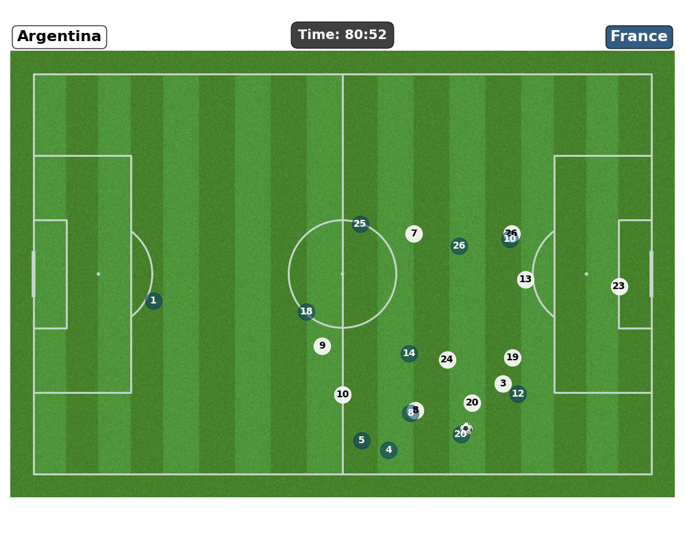
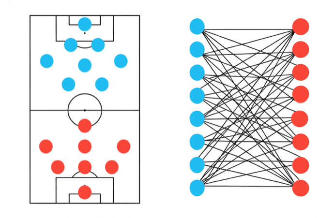
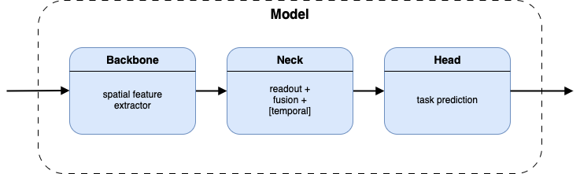

<div align="center">
<h1>SoccerAI</h1>

[Alessio Arcara](https://github.com/alessioarcara), [Francesco Baiocchi](https://github.com/francescobaio), [Leonardo Petrilli](https://github.com/leonardopetrilli)
</div>

## Overview

In this work, we benchmark several graph-neural-network (GNN) architectures to estimate the probability that a given action will culminate in a shot, thereby quantifying how dangerous each action is. Once the shot-likelihood model is trained, we shift our attention to explainability: identifying and interpreting the key factors that drive the network predictions.

<div align="center">
  
</div>

### Dataset 

[2022 FIFA World Cup](https://www.blog.fc.pff.com/blog/pff-fc-release-2022-world-cup-data)

* **Training set:** 48 group-stage matches
* **Validation set:** 16 knockout-stage matches

Two available data streams:

| Stream               | Granularity                   | Contents                    | Usage                                                                          |
| -------------------- | ----------------------------- | --------------------------- | ------------------------------------------------------------------------------ |
| **Event data**       | Sparse        | Labeled events (Pass, shot, tackle, foul, ...) | Primary source for shot prediction                                             |
| **Tracking data** | Dense, 30 Hz | Player & ball positions | 60 frames (≈2 s) before each event to derive momentum—player speed & direction |

We fused event data with short bursts of tracking data, capturing not only *what* happened but also *how* each player was moving at that moment. We then enriched these positional data  with key player statistics scraped from *Transfermarkt* and *FBref*.

### Representation

* **Graph structure** – Each match frame is a graph whose

  * **Nodes** are the 22 players on the pitch.
  * **Edges** encode pairwise spatial relationships (e.g., Euclidean distance).
* **Node features** combine

  * Positional statistics (location, velocity, etc.).
  * Player-specific statistics (market value, age, and other attributes scraped from *Transfermarkt* and *FBref*).

<div align="center">
  
</div>

### Model architecture:

The architecture is fully modular: you can use different backbones to capture spatial features, choose a temporal neck that works on graph or node embeddings, and fine-tune each component through its own configuration file.

<div align="center">
  
</div>

Available backbones:

* **GCN**  [\[paper\]](https://arxiv.org/pdf/1609.02907.pdf)
* **GraphSAGE**  [\[paper\]](https://arxiv.org/pdf/1706.02216.pdf)
* **GATv2**  [\[paper\]](https://arxiv.org/pdf/2105.14491.pdf)
* **GCNII**  [\[paper\]](https://arxiv.org/pdf/2007.02133.pdf)
* **GINE**  [\[papers\]](https://arxiv.org/pdf/1810.00826.pdf) | [\[follow-up\]](https://arxiv.org/pdf/1905.12265.pdf)
* **GraphGPS**  [\[paper\]](https://arxiv.org/pdf/2205.12454.pdf)
* **GNN+**  [\[paper\]](https://arxiv.org/pdf/2502.09263.pdf)

Available necks:

* **Readout → Temporal over graph embeddings** [\[paper\]](https://arxiv.org/pdf/2007.02133.pdf)
* **Temporal over node embeddings → Readout**  [\[paper\]](https://www.mdpi.com/1424-8220/23/9/4506)

Available heads:

- **Graph Classification**

End-to-End alternatives:
- **Diffpool**

> [!TIP]
> Consult the configuration files for additional, specific parameters available for each backbone, neck, and head.

## Installation

<details>
<summary>Click to expand</summary>

Before running the code, you need to install PyTorch and its dependencies. You can choose either the GPU or CPU build depending on your setup. The code has been tested with:

* **PyTorch 2.7.1**
* **CUDA 12.8**
* Optional PyTorch Geometric libraries

### 1. Install PyTorch

| Build               | Command                                                                                     |
| ------------------- | ------------------------------------------------------------------------------------------- |
| **GPU (CUDA 12.8)** | `pip install torch==2.7.1 --index-url https://download.pytorch.org/whl/cu128`         |
| **CPU-only**        | `pip install torch==2.7.1 --index-url https://download.pytorch.org/whl/cpu`                 |

*Note: Be aware of potential mismatches between CUDA versions when installing.*

---
### 2. PyTorch Geometric stack

Install PyTorch Geometric companion wheels **after** PyTorch:

| Build               | Command                                                                                                                                           |
| ------------------- | ------------------------------------------------------------------------------------------------------------------------------------------------- |
| **GPU (CUDA 12.8)** | `pip install pyg_lib torch_scatter torch_sparse torch_cluster torch_spline_conv -f https://data.pyg.org/whl/torch-2.7.1+cu128.html`               |
| **CPU-only**        | `pip install pyg_lib torch_scatter torch_sparse torch_cluster torch_spline_conv -f https://data.pyg.org/whl/torch-2.7.1+cpu.html`                 |

---

### 3. Install project dependencies

```bash
pip install .
```

That’s it—you’re ready to run the code!

</details>

## Repository Structure
```bash
configs/                         # Default and per-model configs
scripts/ 
├── preload_video_frames.py      # Pre-downloads video frames needed for labelling to avoid repeated I/O
├── train.py                     # Trains a selected model
└── eval.py                      # Selects the best checkpoint of a model type and computes accuracy/F1/AP
notebooks/
└── data_collection.ipynb        # Used for manually filtering the unwanted chains and to build the Shot-Prediction dataset
soccerai/              
└── data/              
│   ├── converters.py            # Turns tabular data into sparse PyG graphs (bipartite / FC)
│   ├── data.py                  # Loads World Cup 2022 data and exports Parquet.
│   ├── dataset.py               # PyG-style dataset class; handles preprocessing, imputing, normalisation & splits
│   ├── transformers.py          # scikit-learn transformers for feature engineering & normalization
│   ├── visualize.py             # Pitch frame visualizer (players, ball, side video)
│   ├── temporal_dataset.py      # Torch dataset that groups all frames of each chain into a sequence and pads/collates them so multiple chains can be batched together.
│   ├── enrichers/
│   │   ├── player_velocity.py   # Adds direction & velocity from the last 60 tracking data frames
│   │   └── rosters.py           # Scrapes FBref & Transfermarkt to build player-stat CSV for the World Cup
│   └── label.py                 # Builds positive/negative chains and includes a visual function to filter low-quality ones
└── models/                      # Modular architecture that let's you specify a configurable backbone, neck & head 
│   ├── backbones.py 
│   ├── diffpool.py
│   ├── heads.py
│   ├── layers.py
│   ├── models.py
│   ├── necks.py
│   ├── typings.py
│   └── utils.py       
└── training/                    # Modular training loop with callbacks, metrics & augmentations
    ├── callbacks.py
    ├── metrics.py
    ├── trainer.py
    ├── trainer_config.py        # Schema for configs
    ├── transforms.py
    └── utils.py      
```

## Usage

Two possibilities:

to train a model provided by us by specyfing the name in the main config "base.yaml" and then calling the train script in the "./scripts/train.py"

you can --reload to create the dataset and specyfing a 

## Acknowledgments

This project leverages the **transfermarkt-api** repository by *Felipe Almeida* (MIT License) — https://github.com/felipeall/transfermarkt-api — to obtain player profile data from Transfermarkt.
