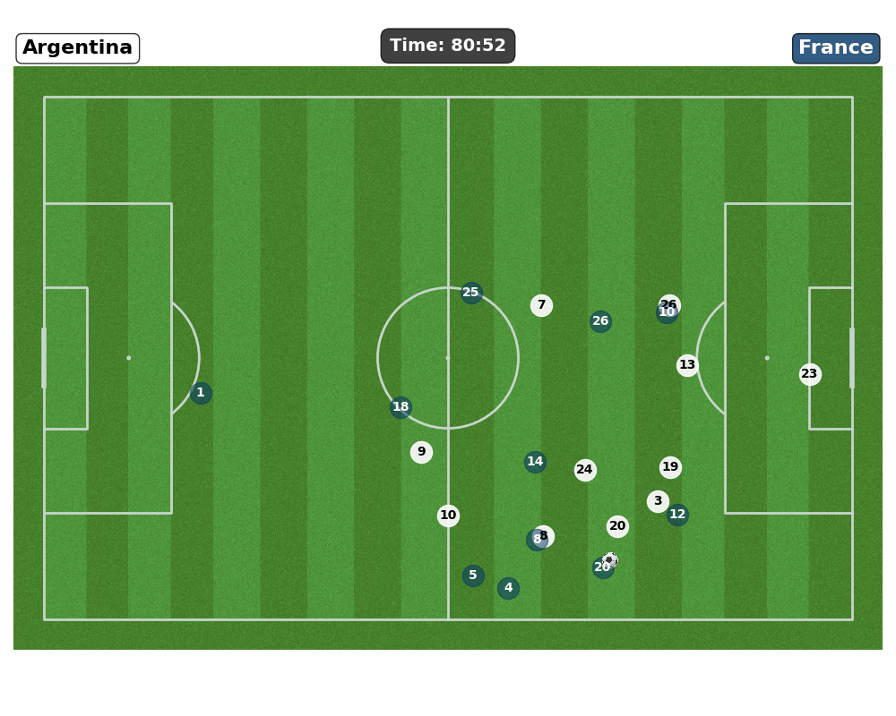
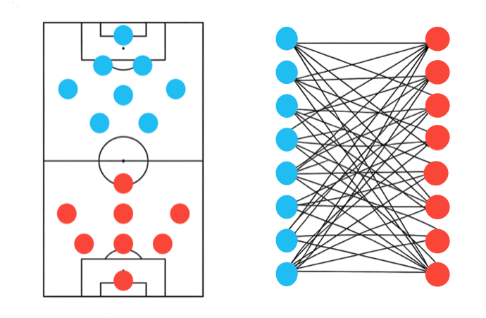
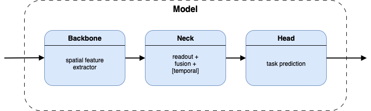

<div align="center">
  
  <br>

  [Alessio Arcara](https://github.com/alessioarcara), [Francesco Baiocchi](https://github.com/francescobaio), [Leonardo Petrilli](https://github.com/leonardopetrilli)
  <div>
  <a href="https://api.wandb.ai/links/soccerai/ysbi1bjl"></a>
  </div>
</div>

## Overview

In this work, we benchmark several graph-neural-network (GNN) architectures to estimate the probability that a given action will culminate in a shot, thereby quantifying how dangerous each action is. Once the shot-likelihood model is trained, we shift our attention to explainability: identifying and interpreting the key factors that drive the network predictions.

<div align="center">
  
  <br>
  <figcaption style="margin-top:0.5rem; font-style:italic; color:#555;">
    Figure&nbsp;1&nbsp;&ndash;&nbsp;An&nbsp;action&nbsp;culminating&nbsp;in&nbsp;a&nbsp;shot
  </figcaption>
</div>

### Dataset 

[2022 FIFA World Cup](https://www.blog.fc.pff.com/blog/pff-fc-release-2022-world-cup-data)

* **Training set:** 48 group-stage matches
* **Validation set:** 16 knockout-stage matches


> [!NOTE]
> Five knock-out matches went to extra time and had no negative chains in
> the labelled data, so they are excluded by default; the validation split
> is therefore the 11 remaining knock-out games (358 chains, 24% positive).
> The attacked goal is derived from the game period (`gameEvents.period`),
> and positive chains are kept only if the action before the shot happens
> within 25 m of the goal line, the same criterion used to select negatives.

Two available data streams:

| Stream               | Granularity                   | Contents                    | Usage                                                                          |
| -------------------- | ----------------------------- | --------------------------- | ------------------------------------------------------------------------------ |
| **Event data**       | Sparse        | Labeled events (Pass, shot, tackle, foul, ...) | Primary source for shot prediction                                             |
| **Tracking data** | Dense, 30 Hz | Player & ball positions | 60 frames (≈2 s) before each event to derive momentum—player speed & direction |

We fused event data with short bursts of tracking data, capturing not only *what* happened but also *how* each player was moving at that moment. We then enriched these positional data  with key player statistics scraped from *Transfermarkt* and *FBref*.

### Representation

* **Graph structure** – Each match frame is a graph whose

  * **Nodes** are the 22 players on the pitch.
  * **Edges** encode pairwise spatial relationships (e.g., Euclidean distance).
* **Node features** combine

  * Positional statistics (location, velocity, etc.).
  * Player-specific statistics (market value, age, and other attributes scraped from *Transfermarkt* and *FBref*).

<div align="center">
  
  <br>
  <figcaption style="margin-top:0.5rem; font-style:italic; color:#555;">
    Figure&nbsp;2&nbsp;&ndash;&nbsp;Player&nbsp;positions&nbsp;(left)&nbsp;mapped&nbsp;to&nbsp;a&nbsp;bipartite&nbsp;interaction&nbsp;graph&nbsp;(right)
  </figcaption>
</div>

### Model architecture:

The architecture is fully modular: you can use different backbones to capture spatial features, choose a temporal neck that works on graph or node embeddings, and fine-tune each component through its own configuration file.

<div align="center">
  
  <br>
  <figcaption style="margin-top:0.5rem; font-style:italic; color:#555;">
    Figure&nbsp;3&nbsp;&ndash;&nbsp;Model&nbsp;architecture
  </figcaption>
</div>

Available backbones:

* **GCN**  [\[paper\]](https://arxiv.org/pdf/1609.02907.pdf)
* **GraphSAGE**  [\[paper\]](https://arxiv.org/pdf/1706.02216.pdf)
* **GATv2**  [\[paper\]](https://arxiv.org/pdf/2105.14491.pdf)
* **GCNII**  [\[paper\]](https://arxiv.org/pdf/2007.02133.pdf)
* **GINE**  [\[papers\]](https://arxiv.org/pdf/1810.00826.pdf) | [\[follow-up\]](https://arxiv.org/pdf/1905.12265.pdf)
* **GraphGPS**  [\[paper\]](https://arxiv.org/pdf/2205.12454.pdf)
* **GNN+**  [\[paper\]](https://arxiv.org/pdf/2502.09263.pdf)

Available necks:

* **Readout → Temporal over graph embeddings** [\[paper\]](https://arxiv.org/pdf/2007.02133.pdf)
* **Temporal over node embeddings → Readout**  [\[paper\]](https://www.mdpi.com/1424-8220/23/9/4506)

Available heads:

- **Graph Classification**

End-to-End alternatives:
- **Diffpool** [\[paper\]](https://arxiv.org/pdf/1806.08804)

> [!TIP]
> Consult the configuration files for additional, specific parameters available for each backbone, neck, and head.

## Installation

The project pins the stack it was validated with (PyTorch 2.7.1 + CUDA 12.8,
PyTorch Geometric 2.6.1, torch_geometric_temporal 0.56.0, polars 1.x) and
ships a `uv.lock`, so a working environment is one command away:

```bash
uv sync --extra dev          # creates .venv with the exact locked versions
source .venv/bin/activate
```

`pyproject.toml` configures the PyTorch (`cu128`) and PyG wheel indexes for
`uv`; on a machine without a GPU the same wheels install and run on CPU.
Without `uv`, install PyTorch 2.7.1 from the `cu128` index, the
`torch_scatter`/`torch_sparse` wheels from `https://data.pyg.org/whl/torch-2.7.0+cu128.html`
and then `pip install -e ".[dev]"`.

## Usage

### Training a model

1. Set `run_name` in `configs/base.yaml` to one of the per-model files
   (`gcn`, `gcn2`, `graphsage`, `gatv2`, `gine`, `graphgps`, `diffpool`).
   `base.yaml` holds the defaults, the per-model file only what differs; any
   unknown key is rejected, so typos cannot be silently ignored.

2. Launch training:

   ```bash
   python scripts/train.py                      # uses configs/
   python scripts/train.py --config-dir my_cfg  # e.g. an ablation copy of configs/
   ```

   Processed datasets live in `soccerai/data/resources/processed/` under a
   name that hashes the `data:` section of the configuration, so changing
   any data option rebuilds them automatically (`--reload` only forces it).
   Runs log to W&B (`WANDB_MODE=offline` keeps them local).

### Key configuration options

| Option | Default | Effect |
| --- | --- | --- |
| `data.normalize_attack_direction` | `True` | mirror frames so the possession team always attacks towards `x = 105`; goal features refer to the attacked goal for every node |
| `data.max_chain_len` | `12` | keep only the last frames of every chain |
| `data.use_roster_features` | `False` | scraped per-player statistics (weight, market value, shooting record, age); constant per player, they let the model identify players |
| `data.use_match_clock` | `False` | match clock as a global feature |
| `data.edge_length_scale` | `10.0` | metres; bipartite edge weight `exp(-distance / scale)` |
| `data.split_mode` / `data.val_ratio` | `chronological` / `0.25` | the 48 group-stage games train, the knock-out games validate (`random` draws a seeded game subset) |
| `data.drop_games_without_negatives` | `True` | drop games whose chains are all positive (the five extra-time matches) |
| `data.goal_window_for_positives` | `25.0` | keep positive chains only if their last action is within 25 m of the goal line, like the negatives (`null` keeps all) |
| `trainer.max_lr` | `null` | peak of the one-cycle schedule (`null` = `lr`) |
| `trainer.pos_weight` | `"auto"` | positive-class weight of the BCE (`#neg / #pos` of the training chains) |
| `trainer.gamma` | `0.1` | per-frame loss discount towards the end of the chain |

Validation metrics (loss, AP, AUROC, accuracy, F-beta) are computed once per
chain at its last frame, consistently with the loss and with `eval.py`.

### Tabular baseline

```bash
python scripts/baseline.py --importance
```

trains a logistic regression and an XGBoost model on hand-crafted features
of the last frame of each chain (same processed data and split as the GNNs)
and prints their validation AP / AUROC / log-loss: the numbers a GNN has to
beat. On the current dataset logistic regression reaches an AP of about 0.60
and an AUROC of about 0.82, XGBoost an AP of about 0.61 and an AUROC of about
0.79, against a 0.24 positive rate.

### Evaluating a trained model

```bash
python scripts/eval.py --name <run_name>
```

* Picks the checkpoint with the lowest monitored value under
  `./checkpoints/<run_name>/` (searched recursively).
* Checkpoints are self-contained (weights, configuration, feature names,
  best-epoch metrics), so evaluation works offline; checkpoints written by
  earlier versions of the code fall back to the W&B run configuration and
  are not compatible with the current architectures.

### Tests

```bash
pytest tests/unit               # synthetic data, a few seconds
pytest tests/test_graph_creation.py   # builds the dataset from the committed parquet
```

Tests that need the raw PFF data are skipped when it is not mounted.

### Rebuilding the dataset

`soccerai/data/resources/raw/dataset.parquet` is built by
`soccerai.data.data.create_dataset` from the raw PFF files (events, tracking,
metadata, rosters). The committed parquet already contains the `period`
column; for an older parquet run `python scripts/patch_dataset_period.py`,
which adds it from the raw event files without re-reading the tracking data.

## Repository Structure
```bash
configs/                         # base.yaml (defaults) + one file per model
scripts/
├── train.py                     # Trains the model selected by run_name
├── eval.py                      # Evaluates the best checkpoint of a run offline
├── baseline.py                  # Tabular reference models on last-frame features
├── patch_dataset_period.py      # Adds the game period to an existing dataset.parquet
└── preload_video_frames.py      # Pre-downloads video frames used for labelling
notebooks/
└── data_collection.ipynb        # Manual filtering of chains and dataset creation
soccerai/
└── data/
│   ├── converters.py            # Tabular frames -> PyG graphs (bipartite / fully connected)
│   ├── data.py                  # Loads World Cup 2022 data and exports the parquet
│   ├── dataset.py               # PyG dataset: preprocessing, split, config-hashed cache
│   ├── transformers.py          # Name-based feature transformers (player, goal, ball)
│   ├── temporal_dataset.py      # Chains of frames, padding and per-graph batching
│   ├── visualize.py             # Pitch frame visualizer
│   ├── enrichers/               # Player velocities from tracking data, roster scraping
│   ├── utils.py                 # Pitch offsets, attacking-direction rule, helpers
│   └── label.py                 # Positive / negative chain extraction and manual filter
└── models/                      # Backbones, temporal necks, heads, DiffPool
└── training/
    ├── trainer.py               # Training loop (per-frame discounted loss)
    ├── metrics.py               # Chain-level metrics (AP, AUROC, confusion matrix) and collectors
    ├── callbacks.py             # Early stopping, checkpointing, explainer
    ├── checkpoint.py            # Self-contained checkpoint format
    ├── trainer_config.py        # Strict configuration schema
    └── transforms.py            # Non-mutating pitch-flip augmentations
tests/
├── unit/                        # Synthetic-data tests of every pipeline stage
└── test_*.py                    # Integration tests on the committed parquet / raw data
```

## Acknowledgments

This project leverages the **transfermarkt-api** repository by *Felipe Almeida* (MIT License) — https://github.com/felipeall/transfermarkt-api — to obtain player profile data from Transfermarkt.
